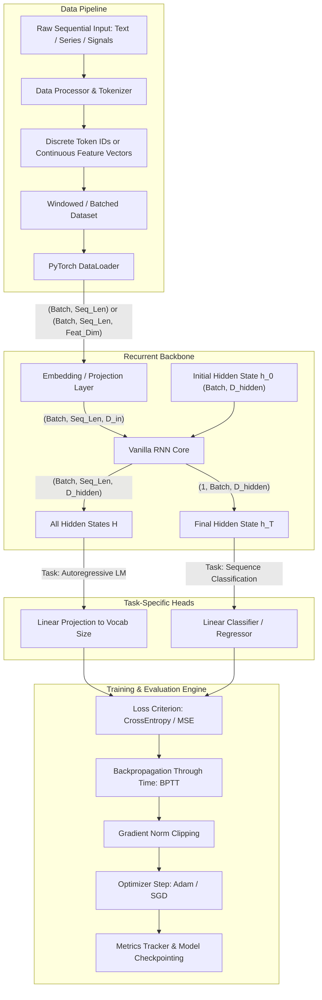

# Vanilla RNN Training Pipeline: System Design & Protocol Specification

> **Audience**: Junior AI Engineers & Researchers  
> **Domain**: Deep Learning / Sequence Modeling / Research Benchmarking  
> **Scope**: Generalized, task-agnostic pipeline architecture centered on Vanilla Recurrent Neural Networks (RNN)  
> **Source Reference**: [`pipeline.md`](file:///home/huycao/Documents/Year4-S1/Intelligence-System/Vanilla%20RNN/docs/pipeline.md)

---

## 1. Executive Summary & Design Principles

The purpose of this document is to elevate the concrete, script-based Vanilla RNN tutorial from `pipeline.md` into an **abstract, reusable architectural blueprint**. When conducting research on recurrent architectures, junior AI engineers often face tight coupling between data parsing, model definition, and training loops, which hinders reproducibility and rapid experimentation.

### Core Engineering Tenets
1. **Separation of Concerns**: Isolate tokenization/encoding, dataset windowing, model recurrence, loss calculation, and optimization into distinct, decoupled components.
2. **Explicit Tensor Shape Contracts**: Every module strictly documents input and output tensor dimensions across every stage boundary.
3. **Task Agnosticism**: Standardize the recurrent backbone so it cleanly bifurcates into either **Autoregressive Generation (Many-to-Many)** or **Sequence Classification / Regression (Many-to-One)** without altering core data or recurrent modules.
4. **Research-Ready Diagnostics**: Standardize hooks for gradient clipping, hidden state monitoring, and evaluation metrics (e.g., Perplexity, Token Accuracy).

---

## 2. End-to-End System Architecture



---

## 3. Tensor Shape Contracts

Adhering to strict tensor shape contracts eliminates 90% of shape mismatch bugs during sequence processing.

### Notation
- `B`: Batch size
- `T`: Sequence length (time steps)
- `V`: Vocabulary size (for discrete tokens)
- `D_in`: Embedding / input feature dimension
- `D_hidden`: Hidden state dimension
- `C`: Number of target classes (classification) or target dimensions

| Pipeline Stage | Input Shape | Output Shape | Semantic Meaning |
| :--- | :--- | :--- | :--- |
| **Tokenization / Encoding** | `List[Raw Item]` | `(Total_Tokens,)` | Raw symbols mapped to numeric indices |
| **Sequence Windowing** | `(Total_Tokens,)` | `(N_samples, T)` | Fixed-length sliding or non-overlapping contexts |
| **DataLoader Batching** | `(N_samples, T)` | `x: (B, T)`, `y: (B, T)` or `(B,)` | Minibatch tensors dispatched to accelerator (`cuda`/`cpu`) |
| **Embedding Layer** | `(B, T)` | `(B, T, D_in)` | Dense distributed representations of discrete tokens |
| **Vanilla RNN Backbone** | `(B, T, D_in)`, `h_0: (1, B, D_hidden)` | `H: (B, T, D_hidden)`, `h_T: (1, B, D_hidden)` | Recurrent state propagation: $h_t = \tanh(W_{ih}x_t + W_{hh}h_{t-1} + b)$ |
| **Autoregressive Head** | `(B, T, D_hidden)` | `Logits: (B, T, V)` | Prediction distribution for the next token at every position |
| **Classification Head** | `(B, D_hidden)` (from $h_T$) | `Logits: (B, C)` | Whole-sequence class distribution |
| **Loss Reshaping (LM)** | `Logits: (B*T, V)`, `y: (B*T)` | `Scalar ()` | Flattened token-level cross-entropy loss |

---

## 4. Component Protocols & Concise Code Signatures

To ensure reusability across projects, write each component against a unified structural contract.

### 4.1 Configuration Protocol (`RNNConfig`)
Centralize all hyperparameters into a typed dataclass to prevent magic numbers across scripts.

```python
from dataclasses import dataclass
from typing import Optional, Literal

@dataclass
class RNNConfig:
    # Model Architecture
    vocab_size: int
    embedding_dim: int = 128
    hidden_dim: int = 256
    num_layers: int = 1
    nonlinearity: Literal["tanh", "relu"] = "tanh"
    task_type: Literal["autoregressive", "classification"] = "autoregressive"
    num_classes: Optional[int] = None
    
    # Sequence & Batching
    seq_length: int = 32
    batch_size: int = 64
    
    # Optimization & Research
    learning_rate: float = 1e-3
    max_grad_norm: float = 1.0  # Crucial for Vanilla RNN gradient explosion
    epochs: int = 20
    device: str = "cuda"
```

---

### 4.2 Data & Vocabulary Protocol (`BaseDataProcessor`)
Decouple text cleaning and vocabulary generation from PyTorch dataset mechanics.

```python
from typing import List, Dict, Tuple

class BaseDataProcessor:
    """Abstract contract for tokenization, vocab construction, and numeralization."""
    def __init__(self, unk_token: str = "<unk>", pad_token: str = "<pad>"):
        self.token_to_id: Dict[str, int] = {}
        self.id_to_token: Dict[int, str] = {}
        self.unk_token = unk_token
        self.pad_token = pad_token

    def clean(self, raw_input: str) -> str:
        """Sanitize raw data (lowercasing, regex cleaning, normalizations)."""
        ...

    def tokenize(self, cleaned_input: str) -> List[str]:
        """Convert stream into tokens (character-level, word-level, or BPE)."""
        ...

    def build_vocab(self, tokens: List[str], max_vocab_size: int = None) -> None:
        """Construct bidirectional mappings: token <-> id."""
        ...

    def encode(self, tokens: List[str]) -> List[int]:
        """Transform token list into array of integer IDs."""
        ...

    def decode(self, token_ids: List[int]) -> List[str]:
        """Transform token IDs back to human-readable tokens."""
        ...
```

---

### 4.3 Dataset & Windowing Protocol (`SequenceDataset`)
Produce uniform sequence pairs regardless of whether the downstream task is generation or classification.

```python
import torch
from torch.utils.data import Dataset
from typing import Tuple

class SequenceDataset(Dataset):
    """
    Modular sequence dataset.
    - If task_type == 'autoregressive': y is x shifted by 1 step (Many-to-Many).
    - If task_type == 'classification': y is a sequence-level label (Many-to-One).
    """
    def __init__(self, encoded_stream: List[int], seq_len: int, task_type: str = "autoregressive", labels: List[int] = None):
        self.inputs = []
        self.targets = []
        
        if task_type == "autoregressive":
            for i in range(len(encoded_stream) - seq_len):
                self.inputs.append(encoded_stream[i : i + seq_len])
                self.targets.append(encoded_stream[i + 1 : i + seq_len + 1])
        elif task_type == "classification":
            # Encoded stream contains sequences with paired class labels
            ...

    def __len__(self) -> int:
        return len(self.inputs)

    def __getitem__(self, idx: int) -> Tuple[torch.Tensor, torch.Tensor]:
        return (
            torch.tensor(self.inputs[idx], dtype=torch.long),
            torch.tensor(self.targets[idx], dtype=torch.long),
        )
```

---

### 4.4 Configurable Vanilla RNN Architecture (`ModularVanillaRNN`)
A unified modular model supporting configurable task heads while keeping the recurrent core intact.

```python
import torch
import torch.nn as nn
from typing import Tuple, Optional

class ModularVanillaRNN(nn.Module):
    def __init__(self, config: RNNConfig):
        super().__init__()
        self.config = config
        
        # 1. Embedding / Feature Ingestion
        self.embedding = nn.Embedding(config.vocab_size, config.embedding_dim)
        
        # 2. Recurrent Backbone
        self.rnn = nn.RNN(
            input_size=config.embedding_dim,
            hidden_size=config.hidden_dim,
            num_layers=config.num_layers,
            nonlinearity=config.nonlinearity,
            batch_first=True
        )
        
        # 3. Modular Task-Specific Head
        if config.task_type == "autoregressive":
            self.head = nn.Linear(config.hidden_dim, config.vocab_size)
        elif config.task_type == "classification":
            self.head = nn.Linear(config.hidden_dim, config.num_classes)
        else:
            raise ValueError(f"Unknown task type: {config.task_type}")

    def forward(
        self, 
        x: torch.Tensor, 
        hidden: Optional[torch.Tensor] = None
    ) -> Tuple[torch.Tensor, torch.Tensor]:
        """
        Args:
            x: (B, T) LongTensor of token IDs.
            hidden: Optional (num_layers, B, D_hidden) initial state.
        Returns:
            logits: (B, T, V) for LM, or (B, num_classes) for classification.
            hidden: (num_layers, B, D_hidden) updated hidden state.
        """
        # (B, T) -> (B, T, D_in)
        embedded = self.embedding(x)
        
        # outputs: (B, T, D_hidden), hidden: (num_layers, B, D_hidden)
        outputs, hidden = self.rnn(embedded, hidden)
        
        if self.config.task_type == "autoregressive":
            # Project all time steps: (B, T, D_hidden) -> (B, T, V)
            logits = self.head(outputs)
        else:
            # Pool last time step: (B, D_hidden) -> (B, num_classes)
            last_step = outputs[:, -1, :]
            logits = self.head(last_step)
            
        return logits, hidden
```

---

### 4.5 Training & Validation Engine (`RNNTrainer`)
Encapsulate the training loop, validation pass, gradient clipping, and checkpoint persistence.

```python
import torch
import torch.nn as nn
from torch.utils.data import DataLoader
from typing import Dict, Any

class RNNTrainer:
    def __init__(self, model: nn.Module, config: RNNConfig, optimizer: torch.optim.Optimizer, criterion: nn.Module):
        self.model = model.to(config.device)
        self.config = config
        self.optimizer = optimizer
        self.criterion = criterion

    def compute_loss(self, logits: torch.Tensor, targets: torch.Tensor) -> torch.Tensor:
        if self.config.task_type == "autoregressive":
            # Flatten across batch and time dimensions: (B*T, V) vs (B*T)
            return self.criterion(logits.reshape(-1, self.config.vocab_size), targets.reshape(-1))
        else:
            # Classification: (B, num_classes) vs (B)
            return self.criterion(logits, targets)

    def train_epoch(self, dataloader: DataLoader) -> float:
        self.model.train()
        total_loss = 0.0
        
        for x, y in dataloader:
            x, y = x.to(self.config.device), y.to(self.config.device)
            self.optimizer.zero_grad()
            
            logits, _ = self.model(x)
            loss = self.compute_loss(logits, y)
            
            loss.backward()
            # Essential for Vanilla RNN stability
            nn.utils.clip_grad_norm_(self.model.parameters(), self.config.max_grad_norm)
            self.optimizer.step()
            
            total_loss += loss.item()
            
        return total_loss / len(dataloader)

    @torch.no_grad()
    def evaluate(self, dataloader: DataLoader) -> Dict[str, float]:
        self.model.eval()
        total_loss = 0.0
        
        for x, y in dataloader:
            x, y = x.to(self.config.device), y.to(self.config.device)
            logits, _ = self.model(x)
            loss = self.compute_loss(logits, y)
            total_loss += loss.item()
            
        avg_loss = total_loss / len(dataloader)
        metrics = {"val_loss": avg_loss}
        
        if self.config.task_type == "autoregressive":
            # Perplexity = exp(cross_entropy_loss)
            metrics["perplexity"] = torch.exp(torch.tensor(avg_loss)).item()
            
        return metrics

    def save_checkpoint(self, path: str, epoch: int, metrics: Dict[str, float]) -> None:
        torch.save({
            "epoch": epoch,
            "model_state_dict": self.model.state_dict(),
            "optimizer_state_dict": self.optimizer.state_dict(),
            "config": self.config,
            "metrics": metrics,
        }, path)
```

---

### 4.6 Inference & Generation Engine (`SequenceGenerator`)
Autoregressive decoding with temperature and top-k filtering.

```python
import torch
import torch.nn.functional as F

class SequenceGenerator:
    def __init__(self, model: nn.Module, processor: BaseDataProcessor, device: str = "cuda"):
        self.model = model
        self.processor = processor
        self.device = device
        self.model.eval()

    @torch.no_grad()
    def generate(self, prompt: str, max_new_tokens: int = 50, temperature: float = 1.0) -> str:
        tokens = self.processor.tokenize(self.processor.clean(prompt))
        input_ids = torch.tensor(self.processor.encode(tokens), dtype=torch.long, device=self.device).unsqueeze(0)
        
        generated_ids = list(input_ids.squeeze(0).cpu().numpy())

        for _ in range(max_new_tokens):
            logits, _ = self.model(input_ids)
            next_token_logits = logits[:, -1, :] / max(temperature, 1e-5)
            probs = F.softmax(next_token_logits, dim=-1)
            
            next_token_id = torch.multinomial(probs, num_samples=1).item()
            generated_ids.append(next_token_id)
            
            next_tensor = torch.tensor([[next_token_id]], dtype=torch.long, device=self.device)
            input_ids = torch.cat([input_ids, next_tensor], dim=1)

        return " ".join(self.processor.decode(generated_ids))
```

---

## 5. Junior AI Engineer Research Guide & Common Pitfalls

When using Vanilla RNN as a research baseline, keep these vital dynamics in mind:

### 1. Vanishing and Exploding Gradients
- **The Cause**: During Backpropagation Through Time (BPTT), repeated matrix multiplications with $W_{hh}$ scale exponentially with sequence length $T$:
  $$\frac{\partial h_T}{\partial h_1} = \prod_{t=2}^T \frac{\partial h_t}{\partial h_{t-1}} = \prod_{t=2}^T \text{diag}(1 - \tanh^2(\dots)) W_{hh}^T$$
  - If the largest eigenvalue of $W_{hh} > 1$, gradients explode ($\to \infty$ or `NaN`).
  - If the largest eigenvalue of $W_{hh} < 1$, gradients vanish ($\to 0$).
- **The Remedy**: Always enforce `torch.nn.utils.clip_grad_norm_(model.parameters(), max_norm=1.0)` before `optimizer.step()`.

### 2. Sequence Length Truncation
- Keep $T \le 35$ for Vanilla RNN. For dependencies beyond 30–50 time steps, Vanilla RNN almost always fails to retain early context due to vanishing gradients.

### 3. Hidden State Lifecycle: Stateless vs. Stateful
- **Stateless (Default & Standard)**: Let PyTorch initialize $h_0 = 0$ at every batch. Batches are assumed independent.
- **Stateful**: If continuous sequential data spans across batches, explicitly pass `hidden.detach()` to the next batch. **Never** pass `hidden` without `.detach()`, or PyTorch will backpropagate through the entire dataset history, causing an Out-Of-Memory (OOM) error.

---

## 6. Recommended Project Layout

Structure your research repository following this modular design:

```
vanilla_rnn_framework/
│
├── configs/
│   └── rnn_baseline.py       # RNNConfig definitions (dataclasses)
│
├── core/
│   ├── processor.py          # BaseDataProcessor, Tokenizer
│   ├── dataset.py            # SequenceDataset, Collate functions
│   ├── model.py              # ModularVanillaRNN, Head definitions
│   ├── trainer.py            # RNNTrainer (train, eval, checkpoint)
│   └── generator.py          # Autoregressive decoding logic
│
├── experiments/
│   ├── run_train.py          # Entrypoint: parses config -> trains model
│   └── run_inference.py      # Entrypoint: loads checkpoint -> generates/evaluates
│
└── docs/
    ├── pipeline.md           # Step-by-step tutorial (reference)
    └── generalized_rnn_pipeline.md # System specification & interfaces
```

---

## 7. Migration Path: From Vanilla RNN to Modern Architectures

Because the pipeline separates the **Input Representation**, **Recurrent Backbone**, and **Task Heads**, upgrading the model requires modifying **only line 15 of `core/model.py`**:

```diff
- self.rnn = nn.RNN(input_size=config.embedding_dim, hidden_size=config.hidden_dim, batch_first=True)
+ # To Upgrade to LSTM:
+ self.rnn = nn.LSTM(input_size=config.embedding_dim, hidden_size=config.hidden_dim, batch_first=True)
+ # Or GRU:
+ self.rnn = nn.GRU(input_size=config.embedding_dim, hidden_size=config.hidden_dim, batch_first=True)
```

The rest of the pipeline—preprocessing, batching, loss computation, gradient clipping, checkpointing, and generation—remains **100% reusable**.
