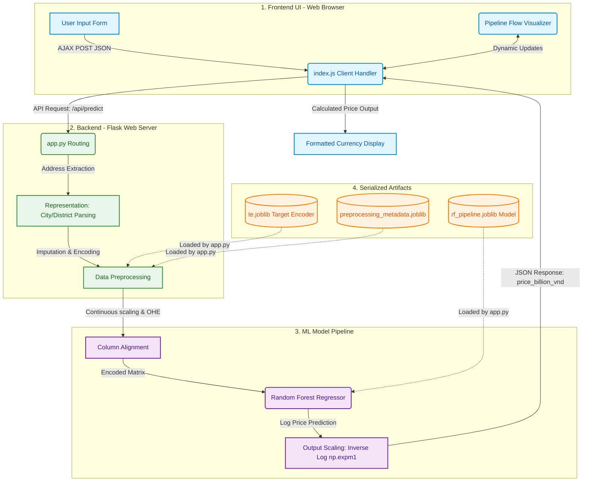

# System Architecture Diagram

This file contains the Mermaid code representing the Vietnam House Price Prediction intelligent system's architecture.

```mermaid
graph TD
    %% Styling
    classDef frontend fill:#e1f5fe,stroke:#0288d1,stroke-width:2px,color:#01579b;
    classDef backend fill:#e8f5e9,stroke:#388e3c,stroke-width:2px,color:#1b5e20;
    classDef model fill:#f3e5f5,stroke:#7b1fa2,stroke-width:2px,color:#4a148c;
    classDef storage fill:#fff3e0,stroke:#f57c00,stroke-width:2px,color:#e65100;

    subgraph Frontend [1. Frontend UI - Web Browser]
        A[User Input Form]:::frontend -->|AJAX POST JSON| B(index.js Client Handler):::frontend
        H(Pipeline Flow Visualizer):::frontend <-->|Dynamic Updates| B
    end

    subgraph Backend [2. Backend - Flask Web Server]
        B -->|API Request: /api/predict| C(app.py Routing):::backend
        C -->|Address Extraction| D[Representation: City/District Parsing]:::backend
        D -->|Imputation & Encoding| E[Data Preprocessing]:::backend
    end

    subgraph ModelPipeline [3. ML Model Pipeline]
        E -->|Continuous scaling & OHE| F[Column Alignment]:::model
        F -->|Encoded Matrix| G(Random Forest Regressor):::model
        G -->|Log Price Prediction| I[Output Scaling: Inverse Log np.expm1]:::model
        I -->|JSON Response: price_billion_vnd| B
    end

    subgraph Persistence [4. Serialized Artifacts]
        TE[(te.joblib Target Encoder)]:::storage -.->|Loaded by app.py| E
        META[(preprocessing_metadata.joblib)]:::storage -.->|Loaded by app.py| E
        RF[(rf_pipeline.joblib Model)]:::storage -.->|Loaded by app.py| G
    end

    B -->|Calculated Price Output| J[Formatted Currency Display]:::frontend
```
